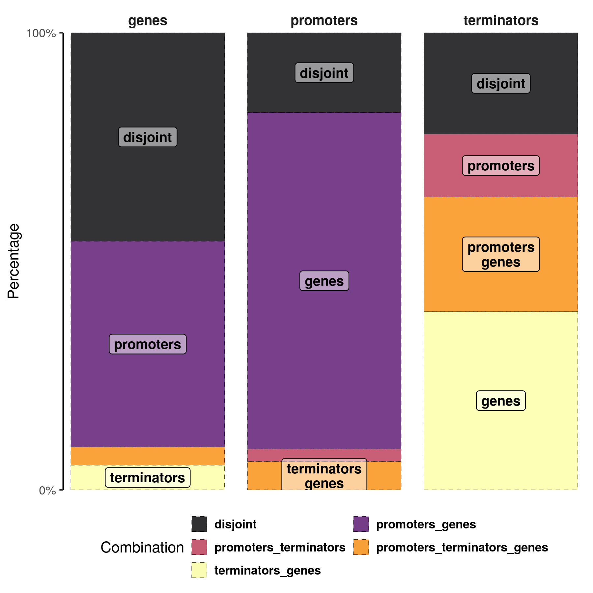
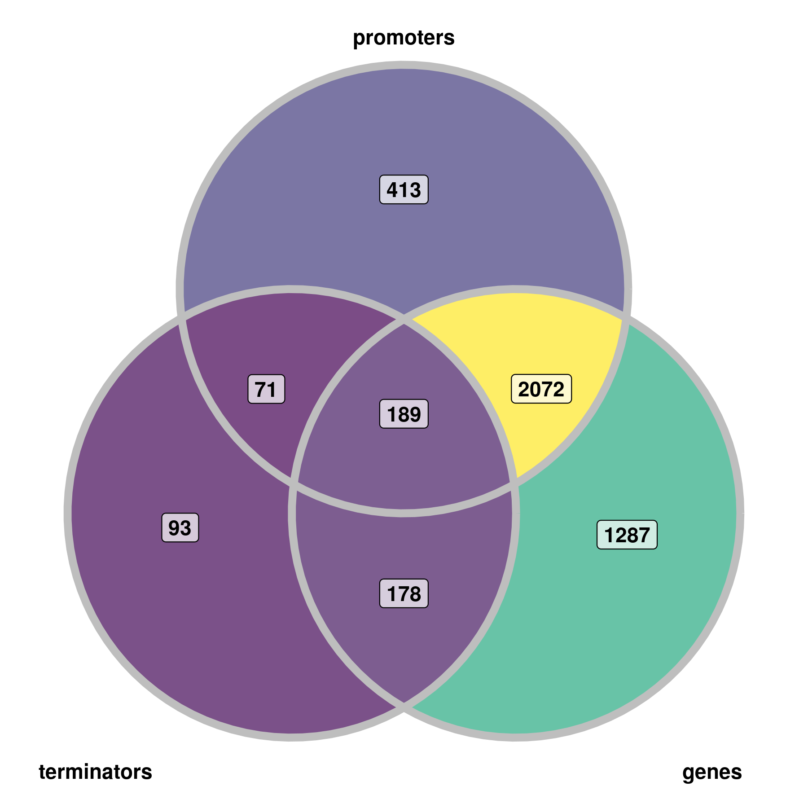
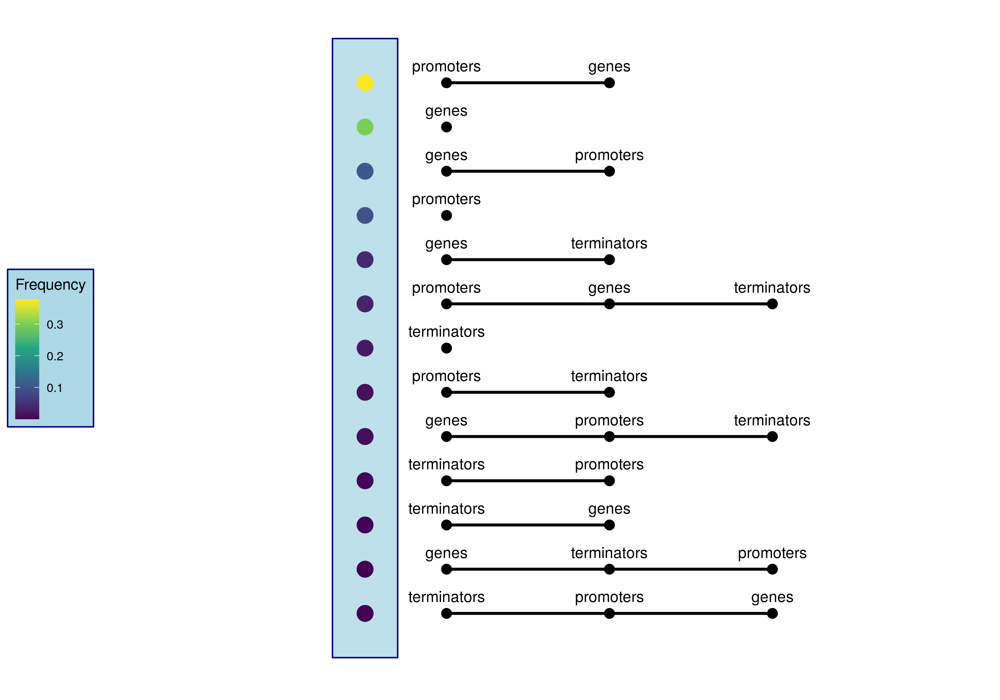

# cooccurrence


## Features

* `nextflow` pipeline to calculate the pairwise cooccurrence of `GFF` files
* Pairwise relations are determined by `bedtools closest`
    * This allows to set detailed constraints for the pairs, e.g. a feature has to occur upstream of another
* Afterwards, the pairs (edges) are iteratively connected to complete graphs (*K_n*) of size *n* , where *n* is the number of input sets (`GFFs`)
   * A combinatorial table is returned with all groups
* A use case is the analysis of the transcriptional structure
    * For example the joint occurrence of predicted promoters, annotated genes and terminators
* Moreover, the intersections are plotted as a Venn diagram and bar plot
* If the `GFFs` are dense and multiple joint calls are possible, consider the usage of `bedtools` *k* parameter to increase the resolution

## How to

* Calculate all complete graphs (combinations) and return them as a `CSV`:

```
nextflow main.nf
```

* Additionally plot them

```
nextflow main.nf -entry plot
```

## Requirements
* General
  * `nextflow >= 21.04.3.5560`
  * `bedtools >= 2.27.1`
  * `python >= 3.7.3`
* Optionally for plots
  * `R >= 4.1.2`
  * `tidyverse >= 1.3.1`
  * `ggVennDiagram >= 1.3.1`


## Notes

 * Files have to be in the `GFF` format and are set in the script 
 * Parameters for `bedtools closest` and maximal distances are passed in a combinatorial table (`CSV` file)
    * Default parameters can be set within the script
    * Only non-default lines have to be set in the config
    * Provide at least one entry in the config
    * Use the simplified file names (`myfile.gff -> myfile`) as identifiers for the combinatorial table
 * Symmetry is not validated, however only undirected edges can be build to *K_{2}* graphs
    * The *k* closest function is not commutative, therefore it is necessary to calculate all permutations
  * Note that *A,B,C* maps to the set *ABC={{(a_1,a_1)},{(a_2,b_2)},{(a_2,b_3,c_3)}}*
      * Elements from the original set may occur multiple times 
    * The sets (the original and non-intersected) reflect single intervals, e.g. *A={a_1, ..., a_n}* and *B={b_1, ..., b_n}*
    * The *intersections* reflect paired joined occurrences of both sets: *intersect(A, B)= {(a_1, b_1), (b_1, a_1), (a_1, b_2)}*
    * The cardinality of the *intersected* sets consists of the original set, e.g. *|A|* and a *product* part of the joined features (*|joined(AxB)|*)
* The script does not handle overlaps in detail 
* Example data was taken from [*RegulonDB*](https://regulondb.ccg.unam.mx/menu/using_regulondb/terms_and_conditions/citing_conditions/index.jsp#) v 10.5 (Alberto Santos-Zavaleta *et al.* 2019)


<p align="center">



</p>
