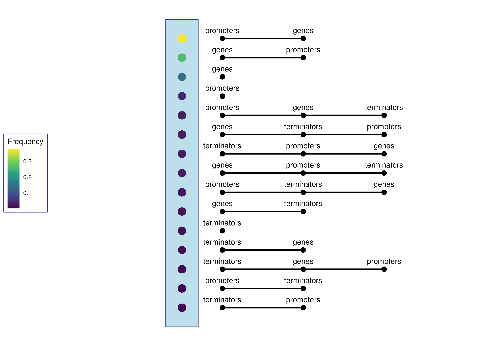
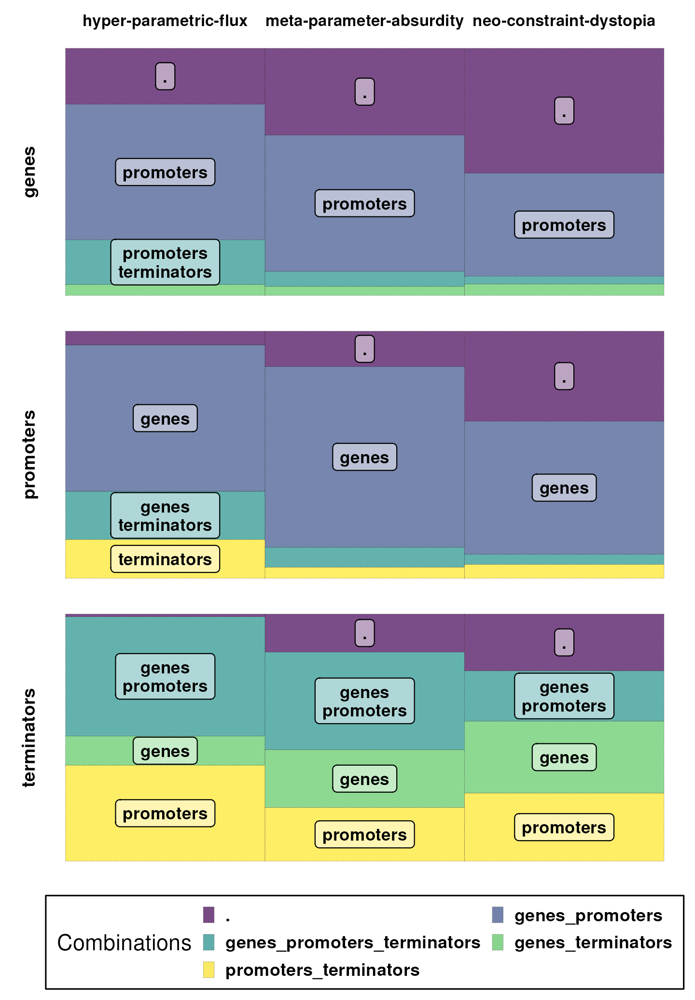

# Cooccurrence Analysis Pipeline

The **cooccurrence** pipeline is designed to calculate pairwise cooccurrence of features within GFF files, facilitating the analysis of their relationships. The pipeline leverages the `bedtools closest` function to determine pairwise relations based on specific constraints, such as one feature occurring upstream of another. Subsequently, maximal cliques are determined, and a combinatorial table is generated containing all identified groups. This workflow is particularly useful for investigating feature interactions and cooccurrences in biological data.

## Features

- Nextflow pipeline for calculating pairwise cooccurrence of features within GFF files.
- Utilizes `bedtools closest` to establish pairwise relationships, allowing detailed constraints for feature pairs.
- Maximal cliques are identified to group cooccurring features.
- Option to generate a CSV file containing all complete graphs (combinations).
- Visualization of the identified cooccurring feature groups is available.

## How to Use

To calculate all complete graphs (combinations) and return them as a CSV:

```bash
nextflow main.nf
```

To additionally visualize the identified cooccurring feature groups:

```bash
nextflow main.nf -entry plot
```

## Requirements

- **General**: nextflow version 21.04.3.5560 or later.

## Notes

- Input files are expected to be in the GFF format and are specified within the script.
- Parameters for `bedtools closest` and maximal distances are provided through a combinatorial table in CSV format.
  - Default parameters can be set within the script.
  - Non-default lines should be configured in the provided configuration.
  - Use simplified file names (e.g., `myfile.gff` -> `myfile`) as identifiers for the combinatorial table.
- The script builds undirected edges for K2 graphs; however, symmetry is not validated.
- Overlapping intervals are not handled in detail.
- Example data is from RegulonDB v 10.5 (Alberto Santos-Zavaleta et al. 2019).

<p align="center">


</p>
